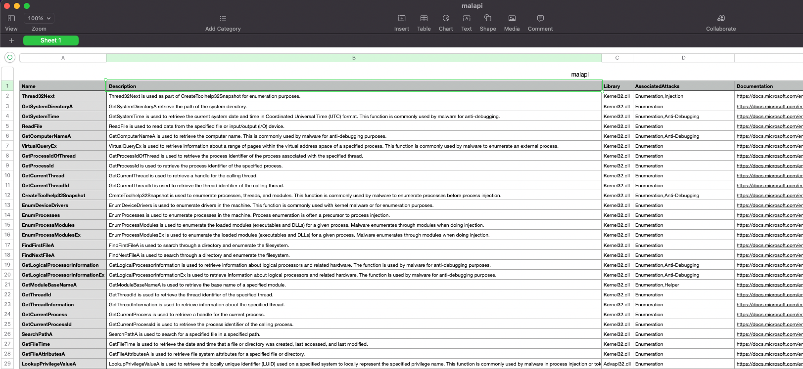

# malapi.io-scraper

Command-line utility that scrapes contents of [malapi.io](https://malapi.io/) and export the results to a csv file.



## Installation

You can find the executable file in the [release](https://github.com/jasontalon/malapi.io-scraper/releases/tag/v1.0.0) page

Or, you may build your own by downloading the Go SDK and by cloning the repository then run the following

```make build```
